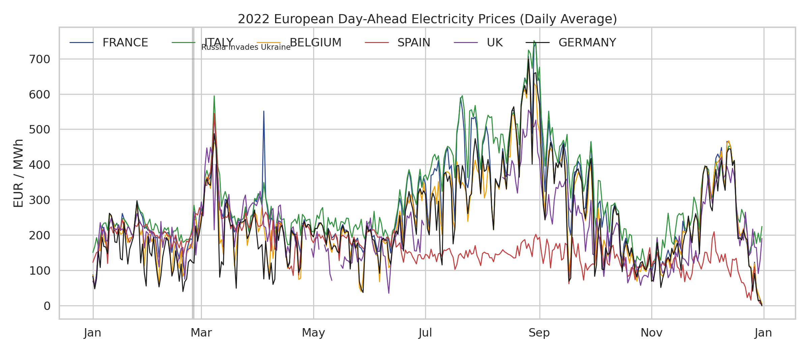
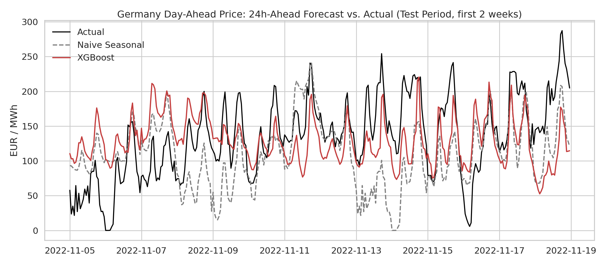

# European Day-Ahead Electricity Price Forecasting (2022)

End-to-end data science project analyzing hourly day-ahead electricity prices across six European
markets (France, Italy, Belgium, Spain, UK, Germany) through the 2022 energy crisis, and building a
model that forecasts **Germany's day-ahead price 24 hours in advance**.



## Highlights

- **EDA** of ~8,760 hourly observations per market: seasonality, intraday shape, cross-market
  correlation, negative-price events, and volatility through the 2022 gas-supply shock
- **Feature engineering**: calendar features, autoregressive lags (24h/48h/168h), rolling
  statistics, and cross-market signals — built with strict train/test leakage discipline
- **Forecasting models**: naive seasonal baseline → Linear Regression → Random Forest → XGBoost,
  evaluated on a chronological (not random) 8-week holdout
- **Tested**: `pytest` unit tests cover data cleaning and feature-engineering correctness

## Results

24-hour-ahead forecast of Germany's day-ahead price, evaluated on the last 8 weeks of 2022:

| Model | MAE (EUR/MWh) | RMSE (EUR/MWh) | MAPE* |
|---|---|---|---|
| Naive Seasonal (same hour, last week) | 104.40 | 133.32 | 112.6% |
| **Linear Regression** | **67.57** | **81.19** | **65.0%** |
| Random Forest | 69.72 | 84.21 | 79.3% |
| XGBoost | 72.09 | 88.16 | 76.8% |

*MAPE is floored near zero-price hours (day-ahead prices can sit near 0 or go negative, where percentage
error is unstable) — MAE/RMSE are the primary metrics.

All three ML models cut the naive baseline's error by roughly 40%. Linear Regression was the strongest
model here: with a single year of hourly data, the target is dominated by a few highly linear
autoregressive signals, so tree ensembles' extra flexibility doesn't pay off — a good reminder to always
benchmark against a simple, well-featured baseline.



## Key findings from the EDA

- **The 2022 energy crisis is visible in the data**: prices across every market climbed through the
  year and peaked in late August, 3-5x above typical levels, as Russian pipeline gas to Europe was cut
  off (gas sets the marginal price in most of these markets).
- **Continental markets move together**: France, Germany, and Belgium are tightly correlated
  (directly interconnected, routinely price-coupled); the UK and Spain (which ran a gas price cap for
  part of 2022) are more loosely coupled to the rest.
- **Negative prices are a real, recurring feature**: Belgium (112 hours) and Germany (69 hours) — both
  with large nuclear/renewables fleets — saw the most negative-price hours in 2022, concentrated around
  the low-demand year-end period.
- **Data quality matters**: the UK series has ~1,400 missing hours even after cleaning; these are
  genuine source-data gaps, not artifacts of processing, and are documented and handled explicitly
  rather than silently imputed.

See the [full notebook](notebooks/electricity_price_forecasting.ipynb) for the complete analysis with
every chart and explanation.

## Project structure

```
.
├── data/raw/                      Raw dataset (as provided)
├── notebooks/
│   └── electricity_price_forecasting.ipynb   Full, executed end-to-end walkthrough
├── src/
│   ├── data_loader.py             Load + clean the raw CSV into an hourly time series
│   ├── features.py                Feature engineering (calendar, lags, rolling stats)
│   ├── eda.py                     Generates all EDA figures
│   └── model.py                   Trains/evaluates the forecasting models
├── outputs/
│   ├── figures/                   All generated charts (PNG)
│   ├── model_results.csv / .json  Evaluation metrics per model
├── models/                        Saved trained model (XGBoost) + feature column list
├── tests/
│   └── test_features.py           Unit tests for data cleaning & feature engineering
├── requirements.txt
└── LICENSE
```

## Setup

```bash
git clone <this-repo>
cd electricity-dah-forecasting
python3 -m venv .venv && source .venv/bin/activate
pip install -r requirements.txt
```

## Usage

Reproduce the full analysis by running the pipeline scripts directly:

```bash
cd src
python3 data_loader.py   # sanity-check the cleaned data
python3 eda.py            # regenerate all EDA figures -> ../outputs/figures/
python3 model.py          # train + evaluate all models -> ../outputs/, ../models/
```

Or open the executed notebook for the narrated walkthrough:

```bash
jupyter notebook notebooks/electricity_price_forecasting.ipynb
```

Run the test suite:

```bash
pytest tests/
```

## Dataset

Hourly day-ahead electricity prices (EUR/MWh) for France, Italy, Belgium, Spain, the UK, and Germany,
covering all of 2022 (`data/raw/electricity_dah_prices.csv`).

## Methodology notes

- **No leakage**: the target is Germany's price shifted 24h into the future; all lag/rolling features
  are computed strictly from past data, and cross-market features use only the 24h-lagged value of
  other countries (what would actually be available at forecast time).
- **Chronological split**: the last 8 weeks of 2022 are held out as the test set — random shuffling
  would leak future information into training for a time series.
- **Missing data**: short gaps (≤3h) are forward-filled; longer gaps (notably in the UK series) are
  left as `NaN` and excluded from computations rather than fabricated.

## Next steps

- Add weather/demand data (temperature, wind & solar generation forecasts) as exogenous features
- Probabilistic forecasting (quantile regression) to capture price-spike risk, not just the point forecast
- Extend to multi-country joint forecasting


MIT — see [LICENSE](LICENSE).
